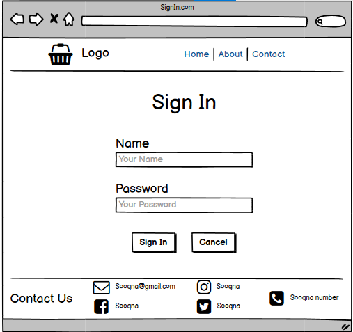
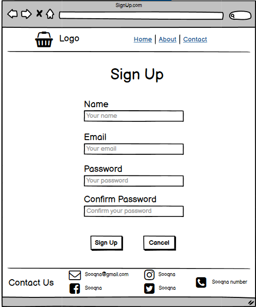
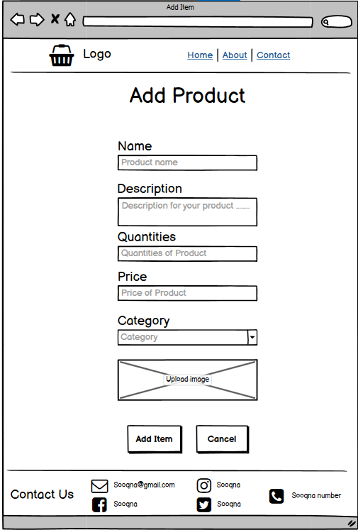
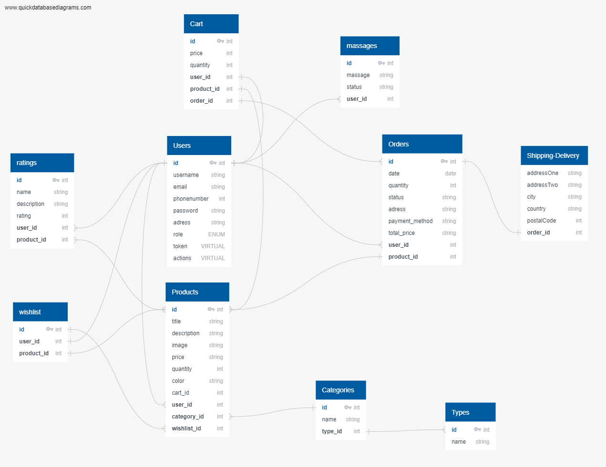

# Sooqna

## Full-Stack-Squad

### Team Members :

1. Esraa Banat (Team Leader)
2. Shams Alsaraireh
3. Banan Zahran
4. Sohiab Al Momani
5. Ahmad Amaireh

## Project Idea

**Sooqna** is an online platform that facilitates consumer-to-consumer sales through its website

### What problem or pain point does it solve?

- Reducing the amount of time, effort, and money spent on product research.

- It provides a simple channel for connecting seller and buyer.

- Offer a safe delivery.

## Wireframes:

|                                           Pages                                            |                                    Pages                                    |
| :----------------------------------------------------------------------------------------: | :-------------------------------------------------------------------------: |
|            |           |
|  |   |

# User Stories and Tasks

## Admin Dashboard

- As an admin user, I would like to have a dashboard where I can see a list of product categories

- As an admin , I would like to view a detail page for each category so that I can eventually edit its data or delete it

- As an admin , I would like to see a list of the products assigned to a category on the category details page

- As an admin , I would like a detail page for each product so that I can eventually edit its data or delete it

- As an admin I would like add and save a new category so that I can expand my product lines

- As an admin I would like to have a dashboard where I can see a list of the users.

## User Site

• As a user, I would like to join a room with anther user.
• As a user, I would like to send a message to anther user him.
• As a user, I would like to see all messages between me and the other user.
• As a user, I would like to rate any product.
• As a user, I would like to see all ratings for a specific product.
• As a user, I would like to view my profile.
• As a user, I would like to update my profile.
• As a user, I would like to delete my profile.
• As a user, I would like to add products to my cart / wish list.
• As a user, I would like to add products from my wish list to cart.
• As a user, I would like to submit / confirm /receive my order/s.

## Domain Modeling

## Database Schema Diagram

## [Team Agreement](./Team-Agreement.md)
