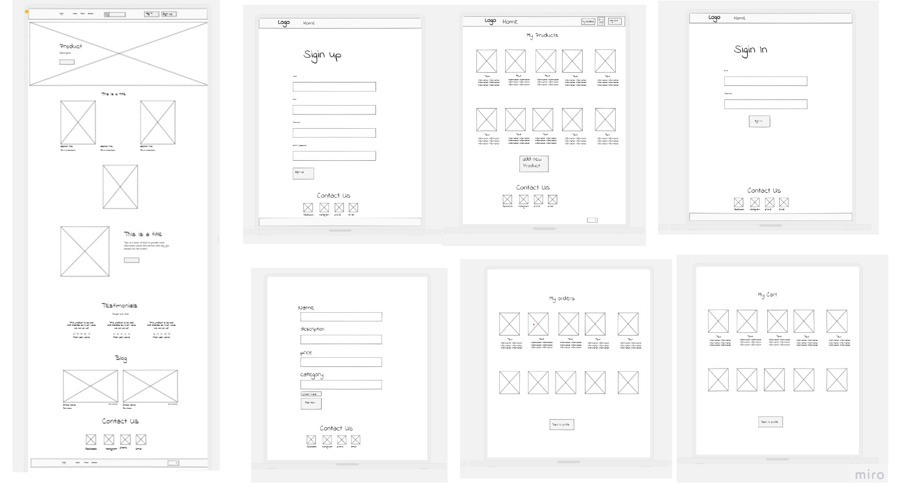
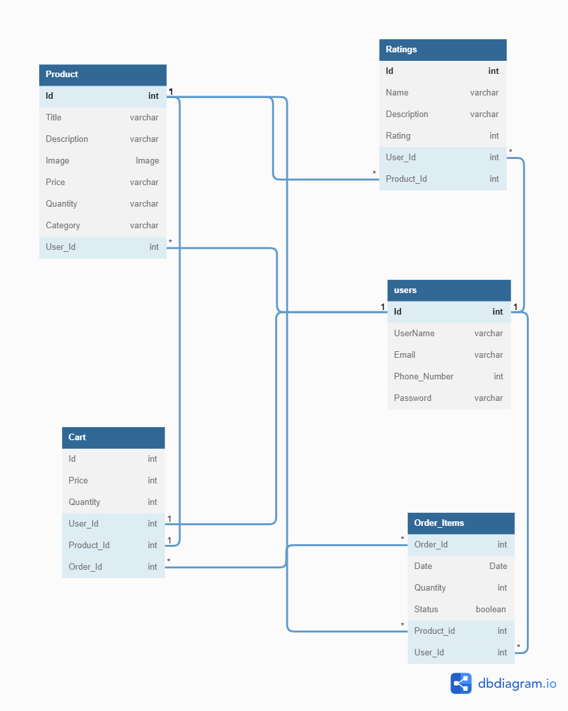

# Sooqna

## Full-Stack-Squad

### Team Members :

1. Esraa Banat (Team Leader)
2. Shams Alsaraireh
3. Banan Zahran
4. Sohiab Al Momani
5. Ahmad Amaireh

## Project Idea

**Sooqna** is an online platform that facilitates consumer-to-consumer sales through its website

### What problem or pain point does it solve?

- Reducing the amount of time, effort, and money spent on product research.

- It provides a simple channel for connecting seller and buyer.

- Offer a safe delivery.

## Wireframes:

# User Stories and Tasks

## Admin Dashboard

- As an admin user, I would like to have a dashboard where I can see a list of product categories

- As an admin , I would like to view a detail page for each category so that I can eventually edit its data or delete it

- As an admin , I would like to see a list of the products assigned to a category on the category details page

- As an admin , I would like a detail page for each product so that I can eventually edit its data or delete it

- As an admin I would like add and save a new category so that I can expand my product lines

- As an admin I would like to have a dashboard where I can see a list of the users.

## User Site

- As a user, I would like to see products available for sale so that I can browse through the inventory for purchase.

- As a user, I would like to register for an account on the site, so that I can make purchases.

- As a user, I would like to securely login to my account so that I can add products to my shopping cart.

- As a user, I would like a way to store the items I wish to purchase in a cart within the application.

- As a user, I would like the ability to view my desired purchases while browsing the other products on the site.

- As a user I would like a dedicated page where I can view all the products I wish to purpose all in one location.

- As a user I would like to add a new items to sell it.

- As a user I would like to update and delete any product I added to sell.

- As a user I would like to check my sales, status, and profit.

## Domain Modeling

## Database Schema Diagram

## [Team Agreement](./Team-Agreement.md)
